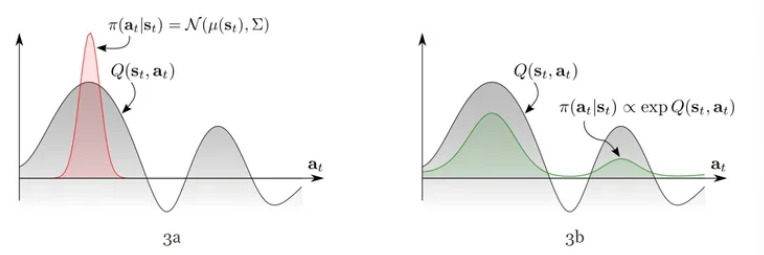
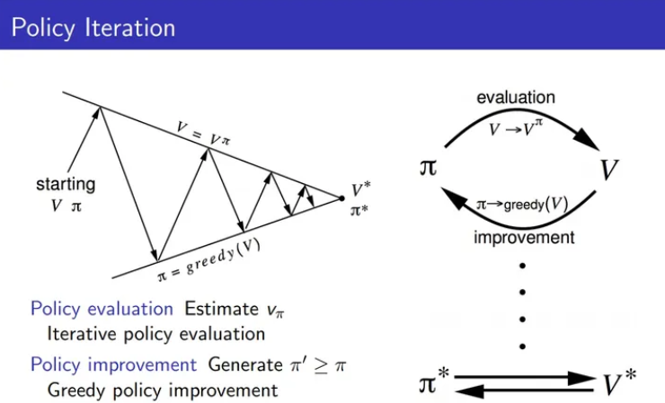

# SAC 学习笔记

本文既是SAC的阅读笔记，同时也是对PPO和DDPG算法的简要总结，所以先花一定篇幅介绍SAC提出的背景，不感兴趣的读者可以直接跳到第二部分。
## 1. SAC's background

SAC提出前，主流的深度强化学习算法（Deep Reinforcement Learning, DRL）在连续动作空间(continuous action space)的控制任务中已经获得了显著的成果，但各自存在一些缺陷。下面先介绍DeepMind和OpenAI在连续控制领域的经典成果。

### 1.1. DDPG(Deep Deterministic Policy Gradient)

DDPG是基于DPG([Deterministic Policy Gradient](http://proceedings.mlr.press/v32/silver14.pdf))实现的DRL算法。

DPG针对连续动作空间的控制任务在传统的PG（[Policy Gradient](https://proceedings.neurips.cc/paper_files/paper/1999/file/464d828b85b0bed98e80ade0a5c43b0f-Paper.pdf)，[OpenAI的PG教程](https://spinningup.openai.com/en/latest/spinningup/rl_intro3.html)）算法上做了改进，将策略函数的输出从一个分布（常用高斯分布）转变为一个唯一确定的动作（通常由一个向量表示，这也是“deterministic“的由来）:

$$ \alpha \sim \pi(\bullet|s) \rightarrow\rightarrow \alpha = \mu(s) $$

同时，DPG引入了AC([Actor-Critic](https://towardsdatascience.com/understanding-actor-critic-methods-931b97b6df3f))框架，让值函数（critic）直接指导策略（actor）优化。DDPG可以视为DPG算法的深度学习版实现，并在DPG上加入了几个提高效率的小技巧：Replay buffers, Target networks。

DPG的思路：

以往的PG算法思路是建立累计收益(Cumulative Return)与策略的关系函数，随后调整策略以追求更大的收益。而DPG算法在根本上不同，DPG算法可以被视为 Q-learning 的连续动作空间版本，其思想在于直接利用critic(Q函数)找到可能的最优决策，随后用找到的最优决策来优化策略函数(actor)，也就是说策略调整完全依赖于critic而不用理会实际的收益。

下面我们先定义AC框架的两个基本成分：

#### 1.1.1 Critic （值函数）：

$$
Q^{\mu}_{\omega}(s,a) : S \times A \rightarrow \mathbb{R} 
$$

$Q$ 函数由参数 （DRL中就是网络参数）控制，将一个状态和动作对映射到一个实数。同 Q-learning，该实数表示，智能体（agent）在状态 执行动作 ，并在之后按照策略 行动，agent 所能获得的预期收益：

$$ Q^{\mu}(s,a) = \mathbb{E} [\sum_{t = 0}^{\infty} \gamma^{t}r(s_{t},a_{t})|s_{0} = s,a_{0} = a] $$

$r(s,a)$ 表示在状态 $s$ 执行动作 $a$ 后，环境反馈的奖励; $\gamma$ 为折扣因子, $\gamma \in (0,1)$ ; $\rho_{\mu}$ 则代表agent按照策略 $\mu$ 行动时，它会遇到的动作、状态对所服从的分布

#### 1.1.2 Actor（策略函数）：

$$
\mu_{\theta}(s): S \rightarrow A 
$$

策略函数由参数 $\theta$ 确定，将状态空间的一个点映射到动作空间的一个点，这也就是决策过程。算法公式：定义了DPG需要的两个主要成分后，利用critic直接优化actor的思想，就有了DPG的核心公式：

$$
\max_{\theta} \mathbb{E}_{s \simeq \text{Data}} \left[ Q^{\mu}_{\omega}(s, \mu_{\theta}(s)) \right] \quad \text{(1.1)}
$$

此时, $Q$ 函数参数固定，只调整策略函数 $\mu$ ; $Q$ 函数另外单独训练，训练方式同 Q-learning(须额外描述)。

寻找最优决策：DPG的最终目的还是在于调整策略，所以先假设已有最优的critic: $Q^{*}$ ,在 $t$ 时刻遇到某个状态 $s_{t}$ ,要求此刻最优动作 $a_{t}^{*}$ , 我们需要做的就是固定住 $Q^{*}$ 函数输入端 $(s,a)$ 当中的状态 $s$ 为 $s_{t}$ ,不断调整输入动作 $a$ ，直到 $Q^{*}$ 的输出值最大，此时的动作 $a$ 即为最优决策 $a_{t}^{*}$, 这个操作等价于一般的Q-learning中的greedy决策方式：

$$ 
a_{t}^{*} = \text{argmax}_{a} Q^{*} (s_{t},a)  \quad \text{(1.2)} 
$$ 

假如我们面临一个需要做决策的情况，而我们知道所有决策的后果（$Q$函数会告诉我们），那么最优决策就是那个可以带来最佳后果的决策。不过不同于Q-learning，在DPG的目标任务中，动作空间是连续的，所以可以直接让 $Q^{*}$ 函数对输入动作 $a$ 求导，这就成了一个将指定的连续可导函数最大化的问题。

优化当前策略：在动作空间中找到针对状态 $s_{t}$ 最优动作 $a_{t}^{*}$ 后，我们就可以根据这个最优动作调整策略，即优化actor: $\mu(s)$ 。让actor模仿这一决策即可（可以把这一步视为监督学习，最优动作就是其标签，优化过程就是让actor在接受 $s_{t}$ 时的输出向标签靠拢）：

$$ 
min_{\theta}[\text{difference of}(\mu_{\theta}(s_{t}, a^{*}_{t}))] \quad \text{(1.3)} 
$$

不过这次策略调整只改变了智能体（agent）在 $s_{t}$ 这单个状态下的决策，接下来还需要将整个状态空间 $S$ 中所有的状态的策略调整到最优，就可以得到最优策略 $\mu^{*}$ .整合成DPG：以上我们将DPG拆成了两步：1.找最优决策；2.优化策略。然而训练actor时，critic接收的输入动作就是actor的输出 $(\mu(s) == a)$ ，所以两步可以直接简化成:

$$ 
\theta_{target} = argmax_{\theta}Q^{*}(s_{t},\mu_{\theta}(s_{t})) 
$$

在实际的算法实现中这一优化过程不是向上面一样一步完成的，毕竟一开始学习时，并没有最优critic $(Q^{*})$ ，深度学习也要求网络参数的更新不能太快。在训练时，actor与环境交互所得的数据会用于训练critic，使之更加准确，向最优 $(Q^{*})$ 靠拢；actor也会根据当前的critic调整自己输出的动作，向最优策略 $\mu^{*}$ 靠近。

- 根据上述可知，DPG及DDPG要求Q函数对动作求导，所以动作空间必然连续，这将导致DPG算法不适用于离散动作空间的任务。
- 训练策略函数时，对于策略的调整需要 函数对动作的导数，所以必然使用AC框架，同时对策略的调整是好是坏完全取决于critic是否准确，最终策略成为函数的附属品，这也导致整个DPG算法其实更偏向于value-based算法（尽管名为policy gradient）。然而，这也给DPG算法带来一个优势——更好地利用过往数据（更加off-policy，这是由于Q-learning本身就是off-policy算法，critic自然可以更多利用过往的数据）。

衍生成果：

[D4PG](https://arxiv.org/abs/1804.08617)（引入分布式的critic，并使用多个actor（learner）共同与环境交互）

[TD3](https://arxiv.org/abs/1802.09477)（参考了double Q-learning的思想来优化critic，延缓actor的更新，计算critic的优化目标时在action上加一个小扰动）

### 1.2. PPO(Proximal Policy Optimization Algorithms)

PPO是TRPO([Trust Region Policy Optimization](https://arxiv.org/abs/1502.05477))的简化版，二者的目标都是：在PG算法的优化过程中，使性能单调上升，并且使上升的幅度尽量大。

PPO同样使用了AC框架，不过相比DPG更加接近传统的PG算法，采用的是随机分布式的策略函数（Stochastic Policy），智能体（agent）每次决策时都要从策略函数输出的分布中采样，得到的样本作为最终执行的动作，因此天生具备探索环境的能力，不需要为了探索环境给决策加上扰动；PPO的重心会放到actor上，仅仅将critic当做一个预测状态好坏（在该状态获得的期望收益）的工具，策略的调整基准在于获取的收益，不是critic的导数。

#### PPO的思路：

PPO的基本思想跟PG算法一致，便是直接根据策略的收益好坏来调整策略。作为一个AC算法，它的基本框架跟[Stochastic Actor-critic](https://proceedings.neurips.cc/paper_files/paper/1999/file/464d828b85b0bed98e80ade0a5c43b0f-Paper.pdf)算法一致，所以先定义PPO的策略函数actor：此时动作 $a$ 服从一个受参数 $\theta$ 控制的条件分布，可以理解为，假如面对某个状态 $s_{t}$ ,agent做出决策动作 $a_{t}$ 的概率 $\mathbb{P}(a_{t}|s_{t};\theta) = \pi_{\theta}(a_{t}|s_{t})$

再定义一个值函数critic： $V_{\omega}^{\pi}(s) : S \rightarrow \mathbb{R}$

将状态映射到实数，该实数表示agent在状态
会获得的期望收益， 是函数参数。与 函数稍有不同， 函数不考虑某个具体的决策的后果，而是综合考虑agent的行动满足策略 时，获得收益的期望： 

$$
V^{\pi}(s) = \mathbb{E}_{s_{t},a_{t}\sim \rho_{pi}}[\sum^{\infty}_{t=0}\gamma^{t}(r(s_{t}, a_{t}))|s_{0}=s]
$$

它与DPG中提到的 $Q$ 函数存在联系：

$$ 
V^{\pi}(s) = \mathbb{E}_{a \sim \pi(\bullet|s)}[Q^{\pi}(s,a)] 
$$
$$ 
Q^{\pi}(s,a) = r(s,a)+\gamma\mathbb{E}_{s'\sim p(s'|s,a)(V^{\pi}(s'))} 
$$

$s'$ 表示 $s$ 状态的下一步状态。$Q$ 函数与 $V$ 函数本质上是值函数的两种表达方式，并且二者可以相互转化。而PPO中不需要求 $Q$ 函数对动作的导数，所以使用 $V$ 函数即可，另外 $V$ 函数的输入少了动作，输入空间小了很多，大大简化值函数。

定义好actor与critic后，开始引出PPO的算法：

#### 1.2.1 Stochastic Actor-critic的单步策略优化的目标函数可以表示为：

其中， $A^{\pi_{\theta}}(s,a)=r(s,a)+\gamma V^{\pi_{\theta}}(s')-V^{\pi_{\theta}}(s)$ ，这是advantage项，表示在 $s$ 状态下某一决策 $a$ 带来的期望收益 $r(s,a)+\gamma V^{\pi_{\theta}}(s')$ 相比原本的期望收益 $V^{\pi_{\theta}}(s)$ 高多少（或者差多少），如果与原本决策一致则advantage为零。

原本 $A(s,a)$ 这个位置是决策的期望收益即 $Q(s,a)$ ，不过用advantage代替期望收益可以增加算法的稳定性，不过无论用哪个，公式的目的都是通过调整策略获取更高的期望收益。可以理解为，如果 $A(s,a)$ 值为正，则提高 $\pi_{(a|s)}$ ，以增加相应决策出现的概率；反之则降低概率。

#### 1.2.2 [importance sampling](https://jonathan-hui.medium.com/rl-importance-sampling-ebfb28b4a8c6)技术，使其成为off-policy算法：

$$ 
L(\theta) = \frac{\pi_{\theta}(a|s)}{\pi_{\theta_{k}}(a|s)}A^{\pi_{\theta_{k}}}(s,a) 
$$

$\pi_{\theta_{k}}$ 表示采集数据时与环境交互的策略, $\pi_{\theta}$ 表示当前正在训练的策略，此时因为训练的策略与采集数据时的策略不同，引入 $\frac{\pi_{\theta}(a|s)}{\pi_{\theta_{k}}(a|s)}$ 项进行修正，使其接近on-policy。由于训练策略 $\pi_{\theta}$ 时的数据不是源于它自己与环境的交互，因此这被称为off-policy算法。

#### 1.2.3 而为了实现（修正：近似地的接近TRPO，不能保证单调提升）性能的单调上升，PPO的做法是训练策略时，强行限制住策略的更新速度，

$$ 
L(\theta) = min(\frac{\pi_{\theta}(a|s)}{\pi_{\theta_{k}}(a|s)}A^{\pi_{\theta_{k}}}(s,a)), \text{clip}(\frac{\pi_{\theta}(a|s)}{\pi_{\theta_{k}}(a|s)}, 1-\epsilon, 1+\epsilon)A^{\pi_{\theta_{k}}}(s,a) 
$$

其中 $\epsilon$ 是一个需要手动调整的参数，大于0。在clip函数的帮助下, $\frac{\pi_{\theta}(a|s)}{\pi_{\theta_{k}}(a|s)}$ 的值被限制在 $(1-\epsilon, 1+\epsilon)$ 中，确定了策略优化时的变化幅度不会太大。

##### 1.2.3.1 [图解PPO](https://jonathan-hui.medium.com/rl-proximal-policy-optimization-ppo-explained-77f014ec3f12)

可以看出，PPO相比原始的PG算(及AC算法)法最为不同的地方在于(左为PG，右为PPO)，每次优化策略时，让策略（参数）朝着优化的方向改进，同时将策略变化限制在一定的范围内。综合起来就是，PPO即希望快点上山，又要注意不能掉下去； 而传统的PG算法则只管用最快速度上山。虽然PPO生硬地限制了策略的更新速度，但是也尽可能保证了更新后的策略不会崩溃（掉下山），最终在效率上PPO反而可以更胜一筹。

PPO在传统的PG算法上加入了如下改进
- 引入importantce sampling技巧，使PG算法成为可以利用过往数据的off-policy算法。
- 引入AC框架，一方面免去PG每次优化策略都需要计算收益（Return）的操作，另一方面可以利用critic计算单步决策的advantage $(r(s,a)+\gamma V(s^{'})-V(s))$ 。
- 使用[GAE](https://arxiv.org/abs/1506.02438), batch training, replay buffer等提高算法性能技巧。
- 严格约束策略参数的更新速度， 使得策略的表现尽量单调上升

### 1.3 主流算法缺陷

- PPO：
依赖于importance sampling实现的off-policy算法在面对太大的策略差异时将无能为力（正在训练的policy与实际与环境交互时的policy差异过大），所以学者们认为PPO其实是一种on-policy的算法，这类算法在训练时需要保证生成训练数据的policy与当前训练的policy一致，对于过往policy生成的数据难以再利用，所以在sample efficiency这条衡量强化学习（Reinforcement Learning, RL）算法的重要标准上难以取得优秀的表现。

    [Evolution Strategies as a scalable alternative to reinforcement learning](https://arxiv.org/abs/1703.03864)

- DDPG:
DDPG：尽管DDPG在实验中有很不错的表现，但是在实际训练时对各种[超参数十分敏感](https://arxiv.org/abs/1709.06560)，所以DDPG在各种benchmark上的优秀表现实际上是精雕细琢而成，难以泛用到大量具体问题。

## 2. [SAC](https://arxiv.org/abs/1801.01290)

为了解决上述经典算法的问题，Tuomas Haarnoja 提出了他的SAC算法，接下来我们正式引入主角SAC。SAC是基于最大熵（maximum entropy）这一思想发展的RL算法，其采用与PPO类似的随机分布式策略函数（Stochastic Policy），并且是一个off-policy，actor-critic算法，与其他RL算法最为不同的地方在于，SAC在优化策略以获取更高累计收益的同时，也会最大化策略的熵。SAC在各种常用的benchmark以及真实的机器人控制任务中性能优秀，而且表现稳定，具有极强的抗干扰能力，是2018年强化学习领域的巨大突破。

### 2.1 简单理解SAC基本思想

SAC中的熵（entropy）可以理解为混乱度，无序度，随机程度，熵越高就表示越混乱，其包含的信息量就更多。假设有一枚硬币，不论怎么投都是正面朝上，则硬币的正反这一变量的熵就低，如果正反出现的概率都为0.5，则该变量的熵相对更高。[参考](https://spinningup.openai.com/en/latest/algorithms/sac.html)

将熵引入RL算法的好处为，可以让策略（policy）尽可能随机，agent可以更充分地探索状态空间
，避免策略早早地落入局部最优点（local optimum），并且可以探索到多个可行方案来完成指定任务，提高抗干扰能力。

### 2.2 最大化熵强化学习(Maximun Entropy Reinforcement Learning, MERL)

**熵的计算**：熵是用于衡量随机变量的随机性，实际计算时直接考虑其服从的随机分布。现在要计算变量 $x$ 的熵值 ，而 $x$ 服从分布 $P$ ，则 $x$ 的熵 $H(P)$ 为: $H(P) = E_{x\sim P}[-logP(x)]$ ，标准的RL算法目标，是找到能收集最多累计收益的策略，表达式为：

$$ 
\pi^{*}_{std} = argmax_{\pi} \sum_{t}\mathbb{E}_{(s_{t},a_{t})\sim \rho_{\pi}}[r(s_{t}, a_{t})]  \quad \text{(2.2)} 
$$

而引入了熵最大化的RL算法的目标策略：

$$ 
\pi^{*}_{MaxEnt} = argmax_{\pi} \sum_{t}\mathbb{E}_{(s_{t},a_{t})\sim \rho_{\pi}}[r(s_{t}, a_{t}) + \alpha H(\pi(\bullet|s_{t}))]  \quad \text{(2.3)} 
$$

$\rho$ 表示在策略 $\pi$ 控制下，智能体(agent)会遇到的状态动作对(state-action pair)所服从的分布。$\alpha$ 为超参数(温度系数)，用于调整对熵值的重视程度。 

可以看到，相比原本的RL算法，MERL只是在奖励后多了一个熵值项，使得策略在最大化累计收益的同时，最大化策略的熵值。不过，MERL的优化目标不只是灵机一动地给原本的RL目标加上一个正则化项，这个优化目标可以从概率图模型（[Probabilistic Graphic Model](https://xlnwel.github.io/blog/reinforcement%20learning/PGM/)）推出，感兴趣的读者可以参考[SVI](https://xlnwel.github.io/blog/reinforcement%20learning/SVI/)。而SAC的作者则表示这个思路源于统计建模中的最大熵方法，最大熵模型的好处是：模型在匹配观察到的信息时，对未知的假设最少。

### 2.3 Soft Value Function and Energy Based Policy

与RL类似，在MERL中，有一套自成一脉的值函数，可以用于评价策略的好坏。参考标准RL和MERL的优化目标 (2.2), (2.3)，我们可以在原本RL的值函数上稍作修改，推出"soft value function"。

#### 2.3.1 原本的值函数如下：

standard Q function:

$$
Q^{\pi}(s,a) = \mathbb{E}_{s_{t},a_{t}\sim \rho_{\pi}}[\sum^{\infty}_{t=0}\gamma^{t}r(s_{t},a_{t})|s_{0}= s,a_{0} = a] 
$$

standard V function:

$$ 
V^{\pi}(s,a) = \mathbb{E}_{s_{t},a_{t}\sim \rho_{\pi}}[\sum^{\infty}_{t=0}\gamma^{t}r(s_{t},a_{t})|s_{0}= s] 
$$

根据MERL的目标函数(2.3), 引入熵, 得出**Soft Value Function(SVF)**:
soft Q function:

$$ 
Q^{\pi}_{soft}(s,a) = \mathbb{E}[\sum^{\infty}_{t=0}\gamma^{t}r(s_{t},a_{t})+\alpha\sum^{\infty}_{t=0}\gamma^{t}H(\pi(\bullet|s_{t}))|s_{0} = s,a_{0} = a]  \quad \text{(2.4)} 
$$

soft V function:

$$ 
V^{\pi}_{soft}(s) = \mathbb{E}_{s_{t},a_{t}\sim \rho_{\pi}}[\sum^{\infty}_{t=0}\gamma^{t}(r(s_{t},a_{t})+\alpha H(\pi(\bullet|s_{t})))|s_{0}= s]  \quad \text{(2.5)} 
$$

观察公式(2.4)(2.5)可知， soft Q 与 soft V 存在联系:

$$
\begin{aligned} 
Q^{\pi}_{soft}(s,a) &= \mathbb{E}_{s^{'}\sim p(s^{'}|s,a), a^{'}\sim \pi}[r(s,a)+\gamma(Q^{\pi}_{soft}(s^{'},a^{'})+\alpha H(\pi(\bullet|s^{'})))] \\ 
&= \mathbb{E}_{s^{'}\sim p(s^{'}|s,a)}[r(s,a)+\gamma V^{\pi}_{soft}(s^{'})]  
\end{aligned} 
$$

上述式1.(2.6)和式2.(2.7)就是 $Q_{soft}$ 的Bellman equation, 在进行策略评估(policy evaluation)时， MERL算法就用上述式1.和式2.进行值迭代(Value iteration)

$$
\begin{aligned} 
V^{\pi}_{soft}(s,a) &= \mathbb{E}_{a^{'}\sim \pi}[(Q^{\pi}_{soft}(s^{'},a^{'})+\alpha H(\pi(\bullet|s^{'})))] \\ 
&= \mathbb{E}_{a\sim \pi}[Q^{\pi}_{soft}(s,a) - \alpha log\pi(a|s)]  
\end{aligned} 
$$

上述式2.(2.9)就是SAC算法中 $V_{soft}$ 函数的值迭代公式，不过一开始并没有用在soft Q-learning中，soft Q-learning中使用的 $V$ 函数定义会在soft Q-learning部分提及。(式1.为2.8)

Energy Based Policy(EBP)
MERL采用了独特的策略模型。为了适应更复杂的任务，MERL中的策略不再是以往的高斯分布形式，而是用基于能量的模型（energy-based model）来表示策略:

$$ 
\pi(a_{t}|s_{t}) \varpropto exp(\varepsilon(s_{t},a_{t}))
$$

$\varepsilon$ 为能量函数，可以用神经网络进行拟合。MERL中，为了让EBP与值函数联系起来，设定：

$$ 
\varepsilon(s_{t},a_{t}) = - \frac{1}{\alpha}Q_{soft}(s_{t},a_{t}) 
$$

所以：

$$ 
\pi(a_{t}|s_{t})\varpropto exp(\frac{1}{\alpha}Q_{soft}(s_{t},a_{t})) \quad \text{(2.10)} 
$$

下图展示了一般的高斯分布策略（左）与基于能量的策略（右）的区别。可以看出基于能量的模型在面对多模态（multimodal）的值函数 $Q(s,a)$ 时，具有更强的策略表达能力，而一般的高斯分布只能将决策集中在 值更高的部分，忽略其他次优解。

 [source](https://bair.berkeley.edu/blog/2017/10/06/soft-q-learning/)

### 2.4 Soft Policy Evaluation and Soft Policy Improvement in Soft Q-learning

有了MERL框架中值函数与策略的基本定义后，我们就可以开始构建MERL框架下的算法。与标准的RL一样，MERL算法同样包括策略评估（Policy Evaluation），与策略优化（Policy Improvement），在这两个步骤交替运行下，值函数与策略都可以不断逼近最优。最终足够优秀的策略便可用于实际应用。

#### 2.4.1 Soft Policy Evaluation
先要想办法给 soft value function $(V_{soft},Q_{soft})$ 填上正确的值，让它们可以逼近理论上的真实结果 (2.5), (2.4)，正确地预测策略能给 agent 带来的收益，这一步就被称为策略评估（policy evaluation）。然而，直接按照 (2.5), (2.4) 计算真值并不现实，所以就需要像Q-learning一样，通过不断地值迭代（value iteration），让 $Q$ 函数逼近最优 $Q_{*}$ 。

SAC中使用的值迭代公式就是(2.6)，(2.7) 和 (2.9)，不过它的前身 Soft Q-learning(SQL) 所使用的值迭代的公式却不一样，甚至采用了不同的值函数定义。只对SAC感兴趣的读者可以直接跳到后面的 SAC 部分。

#### Soft V function in SQL(soft Q-learning)

重新定义SQL中的V函数：

$$ 
V_{soft}(s) = \alpha log \int exp(\frac{1}{\alpha}Q_{soft}(s,a))da \quad \text{(2.11)} 
$$

soft 的由来：观察这个式子，其中 $log\int exp$ 这个操作就被称为"softmax"，这也是全文中“soft”的由来。与之相对应的就是 Q-learning 中使用的"hardmax": $V(s) = max_{a}Q(s,a)$ , (2.11)等价于: $V(s) = \alpha \text{softmax}_{a}\frac{1}{\alpha}Q(s,a) $  (注意： 越接近0，softmax 就越接近 hardmax).

对比 函数定义(2.11)与 (2.9)，发现同样是 $V$ 函数，SQL与SAC却大不相同，不过既然我们知道了softmax的含义，就可以猜测——当 (2.9) 取最大值，即策略最优时，两式其实在数值上相等。看懂SQL之后可以明白，因为SQL的策略可以直接由值函数表达，所以SQL可以直接将策略优化放进值迭代中。 (2.9) 与 (2.11) 的关系可以参考Q-learning，$Q$ 函数的标准定义是：

$$ 
Q^{\pi}(s,a) = r(s,a) +\mathbb{E}_{s^{'}\sim p(s_{'}|s,a),a^{'}\sim \pi}[\gamma(Q^{\pi}(s^{'},a^{'}))] 
$$

但实际的Q-learning的迭代算法中却是：

$$ 
Q^{\pi}(s,a) = r(s,a) +\gamma max_{a_{'}}(Q^{\pi}(s^{'},a^{'})) 
$$

这是由于Q-learning算法中，将策略评估与策略优化直接一步完成了，而SQL在值迭代时也做了同样的事，所以造成了(2.9)与 (2.11) 的差异。

#### 解目标函数
虽然 (2.3) 的解可以粗暴地用policy gradient(PG)算法来逼近，不过有更巧妙的办法来简化运算。同时在这个过程中，我们可以将 soft value function 和 energy based policy联系起来，并推出Soft Q learning[SQL](https://arxiv.org/abs/1702.08165) 的值迭代算法。 [参考](https://xlnwel.github.io/blog/reinforcement%20learning/SVI/)

$$ 
\mathcal{J}(\pi) = \sum^{T}_{t=1} \gamma^{t-1}E_{s_{t}，a_{t}\sim \rho_{\pi}}[r(s_{t},a_{t})+\alpha\mathcal{H}(\pi(\bullet|s_{t}))] \quad \text{(2.12)}
$$

我们要做的就是调整输入 $\pi$ ，让目标函数 $\mathcal{J}$ 最大化。那么，由易到难，先解 $\mathcal{J}$ 中的最后一项 $t=T$。此时，

$$
\begin{aligned} 
\pi(\bullet|S_{T} &= argmax_{\pi(\bullet|s_{T})})\mathbb{E}_{a_{T}\sim \pi(\bullet|s_{T})}[r(s_{T},a_{T})+\alpha H(\pi(\bullet|s_{T}))] \\ 
&= argmax_{\pi} \int[r(s_{T},a_{T}) - \alpha log \pi(a_{T}|s_{T})]\pi(a_{T}|s_{T})da_{T}
\end{aligned} 
$$

既然要最大化右式，那么让其对 $\pi(a_{T}|s_{T})$ 求导，令导数为零，可以求得解：

$$ \pi(a_{T}|s_{T}) = \frac{exp(\frac{1}{\alpha}r(s_{T},a_{T}))}{\int exp \frac{1}{\alpha}r(s_{T},a)} da $$

[参考](https://blog.csdn.net/qq_25156657/article/details/85992203)，根据(2.4)(2.11), 此时：

$$ 
Q(s_{T},a_{T}) = r(s_{T},a_{T}) 
$$

$$ 
V(s_{T}) = \alpha log\int exp(\frac{1}{\alpha}Q(s_{T},a))da 
$$

所以有：

$$
\begin{aligned} 
\pi(a_{T}|s_{T}) &= \frac{exp(\frac{1}{\alpha}Q(s_{T},a_{T}))}{\int exp \frac{1}{\alpha}Q(s_{T},a)} da \\ 
&= exp(\frac{1}{\alpha}(Q(s_{T},a_{T})-V(s_{T})))
\end{aligned} 
$$

下面进一步推广到通常情况。

$$ 
\pi(\bullet|s_{T}) = argmax_{\pi(\bullet|s_{t})}E_{a_{t}\sim \pi(\bullet|s_{t})}[r(s_{t},a_{t})+\alpha \mathcal{H}(\pi(\bullet|s_{t}))+\gamma E_{p(s_{t}+1|s_{t},a_{t})}[V(s_{t}+1)]] 
$$

求解可得：

$$ 
\pi(a_{t}|s_{t}) = exp(\frac{1}{\alpha}(Q(s_{t},a_{t})-V(s_{t}))) \quad \text{(2.13)} 
$$

此时，

$$ 
Q(s_{t},a_{t}) = r(s_{t},a_{t})+\gamma E_{p(s_{t+1}|s_{t},a_{t})}[V(s_{t+1})] 
$$

$$ 
V(s_{t}) = \alpha log \int exp(\frac{1}{\alpha}Q(s_{t},a))da 
$$

最终，一方面，我们得到了策略（policy）最优解的表达式 (2.13) ，同时可以发现，这个解与Energy Based Policy(EBP)的形式 (2.10) 高度契合，所以soft value function可以自然地与EBP关联到一起。

另一方面，根据上面的求解过程，我们可以得出 soft Q learning 用的值迭代算法：
Soft Value Iteration Algorithm

$$ 
V(s_{T}+1) = 0 
$$

$$ 
for t = T to 1: 
$$

$$ 
Q(s_{t},a_{t}) = r(s_{t},a_{t})+\gamma E_{p(s_{t+1|s_{t},a_{t}})}[V(s_{t+1})]  \quad\forall s_{t},a_{t} 
$$

$$ 
V(s_{t}) = \alpha log\int exp(\frac{1}{\alpha}Q(s_{t},a_{t}))da_{t}   \quad\forall s_{t} 
$$

依照这个算法迭代至两个值函数收敛，就可以完成对策略的评估。

#### 2.4.2 Soft Policy Improvement
完成对当前策略的评估后，我们根据当前值函数更新优化策略，就像在Q-learning中:

$$ 
\pi_{new} = argmax_{\pi}Q^{\pi^{old}}(s_{t},\pi(s_{t})), \quad\forall s_{t} 
$$

不过在MERL中，我们可以发现策略的最优解形式(2.13)已经在上一步中推导了出来，并且可以直接用值函数表达出来。所以策略迭代优化的公式刚好就是：

$$ 
\pi_{new} = \frac{exp(\frac{1}{\alpha}Q^{\pi_{old}}_{soft}(s_{t},a_{t}))}{exp\frac{1}{\alpha}V_{soft}^{\pi_{old}(s_{t})}} , \quad\forall s_{t} \quad \text{(2.14)} 
$$

在[soft Q-learning](https://arxiv.org/abs/1702.08165)论文中有证明这样的更新策略可以提升策略的表现。

#### 2.4.3 Soft Q-learning(SQL)
已经有了策略评估和策略优化的具体操作过程，将这两步整合起来，就可以形成MERL算法。在soft Q-learning 算法中，我们先随机初始化策略和值函数，随后循环运行三个步骤：
- 让智能体用当前的策略与环境交互采集数据。
- 利用采集到的数据实现策略评估。
- 利用评估完成的值函数完成策略优化
最终就可以收敛到最优策略和最优值函数，这个算法的流程跟大多数RL算法没有区别，不过在具体实现时却会存在困难。
1. 在策略评估时，根据(2.11)式，需要对动作求积分，然而这个操作在连续的动作空间中是不可能实现的。
为了解决这个问题，实际的算法中采用了“采样+importance sampling”方法来近似 函数的期望值。在初期进行随机均匀采样，后期根据policy来采样。

$$ 
V^{\theta}_{soft}(s) = \alpha log \mathbb{E}_{q_{a^{'}}}[\frac{exp(\frac{1}{\alpha}Q^{\theta}_{soft}(s_{t},a^{'}))}{q_{a^{'}}(a^{'})}] 
$$

q是用于采样的分布。

2. 基于能量的模型是intractable。虽然根据(2.14)，策略函数可以直接用值函数表示成EBP，但是，表示出的EBP却不能像一般的高斯分布一样直接对其进行采样，SQL理论上的用能量模型与环境交互的操作无法实现。
针对第二个问题，作者使用近似推理技术，如马尔可夫链蒙特卡罗(Markov chain Monte Carlo)。同时为了加速推理，算法使用了Amortized Stein variational gradient descent (SVGD) 训练的推理网络生成近似样本。其实就是作者使用了一个可以用来表示策略的网络（state-conditioned stochastic network）来代替EBP进行采样。随后利用KL散度来缩小用代理策略 $\pi^{phi}$ 与EBP之间的差距：

$$ 
J_{\pi}(\phi ;s_{t}) = D_{KL}(\pi^{\phi}(\bullet|s_{t})\| exp(\frac{1}{\alpha}(Q
^{\theta}_{soft}(s_{t},\bullet)-V^{\theta}_{soft}))) 
$$

### 2.5 Soft Policy Evaluation and Soft Policy Improvement in SAC
前文提出了MERL的理论基础，并引出了SAC的前身 soft Q-learning，不过我们也可以看出其实现困难，最终的实现也是理论上soft Q-learning的近似。后来 Tuomas 改进优化了SQL，提出了SAC算法。

先回到 Soft Policy Evaluation and Soft Policy Improvement

#### 2.5.1 Soft Policy Evaluation
前文已经提到过，SAC的值迭代式就是(2.6)，(2.7)，(2.9)，而Tuomas 在SAC中放弃了使用softmax来直接求 函数的值，所以自然就不需要再对动作空间积分。

##### soft Q function的值迭代公式：

$$
\begin{aligned} 
Q^{\pi}_{soft}(s,a) &= \mathbb{E}_{s^{'}\sim p(s^{'}|s,a), a^{'}\sim \pi}[r(s,a)+\gamma(Q^{\pi}_{soft}(s^{'},a^{'})+\alpha H(\pi(\bullet|s^{'})))] \\ 
&= \mathbb{E}_{s^{'}\sim p(s^{'}|s,a)}[r(s,a)+\gamma V^{\pi}_{soft}(s^{'})]  
\end{aligned} 
$$

如果在SAC中，我们只打算维持一个值函数 $Q$ ，那么可以只用(2.6)式进行值迭代；如果需要同时维持 $V,Q$ 两个值函数，就使用(2.7)(2.9)进行值迭代。

##### soft V function的值迭代公式：

$$ 
V^{\pi}_{soft}(s,a) = \mathbb{E}_{a\sim \pi}[Q^{\pi}_{soft}(s,a) - \alpha log\pi(a|s)] \quad \text{(2.9)} 
$$ 

#### 2.5.2 Soft Policy Improvement

SAC中的理想策略依然是(2.10)的EBP形式，不过由于EBP无法采样的问题依然存在，所以只能用一个高斯分布 $\pi$ 来代替EBP与环境交互，随后在策略优化时，让这个高斯分布尽可能向EBP靠近。 $\pi$ 与EBP的距离用KL-divergence来衡量。策略优化公式为：

$$ 
\pi_{new} = argmin_{\pi\in\Pi}D_{KL}(\pi(\bullet|s_{t})\|\frac{exp(\frac{1}{\alpha}Q^{\pi^{old}}_{soft}(s_{t},\bullet))}{Z^{\pi_{old}}_{soft}(s_{t})}) \quad \text{(2.15)} 
$$

其中 $\Pi$ 表示可选的策略集合，实际上就是带参数的高斯分布的集合。$Z$ 函数代替了(2.14)中的 $exp(\frac{1}{\alpha}V^{\pi_{old}}_{soft}(s_{t}))$ 作为配分函数，用于归一化分布，不过对于 $\pi(s_{t})$ 来说，两者都是常数，在实际计算时二者都可以直接忽略。同时也由于这个原因，在SAC中也不用再维持 $V$ 函数。
作者在论文附录B.2中证明了这个公式可以像(2.14)一样保证策略的优化，不过实际上在后文的(2.15)展开式中可以直接发现其与DPG的联系。

#### 2.5.3 Soft Policy Iteration
与大多数RL算法一样，算法交替执行 Soft Policy Evaluation 与 Soft Policy Improvement 这两个步骤，就可以收敛到最优的值函数与最优策略，这一过程被称为Soft Policy Iteration

#### 2.5.4 SAC中策略评估与策略优化的实现
SAC的实际实现中，值函数与策略各由一个由参数控制的神经网络来拟合。我们把 $Q$ 函数和策略分别定义为 $Q_{theta}(s,a)$ 和 $\pi_{\phi}(\bullet|s)$。$Q$ 函数接收输入状态动作对 $(s,a)$ 输出一个实数值作为 $Q$ 值；策略接收输入状态 $s$ ，输出一个关于动作的分布，作为策略（其实就是输出一个高斯分布的均值 $\mu$ 与标准差 $\sigma$ ），需要一个确切的动作时，则对均值 $\mu$ ，标准差 $\sigma$ 的高斯分布进行一次采样，采样结果作为策略的决策动作。

根据(2.6)，可以得出函数训练时的损失函数：

$$ 
J_{Q}(\theta) = \mathbb{E}_{(s_{t},a_{t},s_{t+1})\sim \mathcal{D},a_{t+1}\sim \pi_{\phi}}[\frac{1}{2}(Q_{\theta}(s_{t},a_{t})-(r(s_{t},a_{t})+\gamma(Q_{\theta}(s_{t+1},a_{t+1})-\alpha log(\pi_{\phi}(\pi_{\phi}(a_{t+1}|s_{t+1})))))^{2}] \quad \text{(2.16)} 
$$

在训练 $Q(s_{t},a_{t})$ 时, $(s_{t},a_{t})$ 是从agent与环境过往的交互中产生的数据（replay buffer）抽取出的，但 $a_{t+1}$ 是在训练时临时从策略 $\pi_{\phi}$ 中采集出来的。根据(2.15), 可以得出训练策略 $\pi_{\phi}$ 时的损失函数：

$$
\begin{aligned} 
J_{\pi}(\phi) &= D_{KL}(\pi_{\phi}(\bullet|s_{t})\|exp(\frac{1}{\alpha}Q_{\theta}(s_{t},\bullet)-logZ(s_{t}))) \\
&= \mathbb{E}_{s_{t}\sim\mathcal{D},a_{t}\sim\pi_{\phi}}[log(\frac{\pi_{\phi}(a_{t}|s_{t})}{exp(\frac{1}{\alpha}Q_{\theta}(s_{t},a_{t})-logZ(s_{t}))})] \\  
&= \mathbb{E}_{s_{t}\sim\mathcal{D},a_{t}\sim\pi_{\phi}}[log\pi_{\phi}(a_{t}|s_{t})-\frac{1}{\alpha}Q_{\theta}(s_{t},a_{t})+logZ(s_{t})] \\
\end{aligned} 
$$

这里使用了[reparameterization](https://stats.stackexchange.com/questions/199605/how-does-the-reparameterization-trick-for-vaes-work-and-why-is-it-important)， 是从replay buffer中取出来的，而 是从当前的策略 中采样得来, 由 $a_{t}\sim\pi_{\phi}$ ,引入reparameterization技术，有：

$$ 
a_{t} = f_{\phi}(\varepsilon_{t};s_{t}) = f^{\mu}_{\phi}(s_{t})+\varepsilon_{t}\bigodot f^{sigma}_{\phi}(s_{t}) 
$$

同时，由于在对策略的参数求导时, $Z$ 不受策略参数 $\phi$ 影响，所以直接将其忽略。最终得到：

$$ 
J_{\pi}(\phi) = \mathbb{E}_{s_{t}\sim\mathcal{D},\varepsilon\sim\mathcal{N}}[\alpha log\pi_{\phi}(f_{\phi}(\varepsilon_{t};s_{t})|s_{t}) - Q_{\theta}(s_{t},f_{\phi}(\varepsilon_{t};s_{t}))]  \quad \text{(2.17)} 
$$

最后，只需要不断收集数据，缩小这两个损失函数，就可以得到收敛到一个解。在初版的SAC中，作者表示同时维持两个值函数，可以使训练更加稳定，不过在第二版中，作者引入了自动调整温度系数 $\alpha$ 的方法，使得SAC更加稳定，于是就只保留了 $Q$ 函数。

### 2.6 Tricks in SAC

SAC中借用了许多提升性能的技巧，包括[double Q network](https://proceedings.neurips.cc/paper_files/paper/2010/hash/091d584fced301b442654dd8c23b3fc9-Abstract.html), [target network](https://datascience.stackexchange.com/questions/32246/q-learning-target-network-vs-double-dqn).不过上面两个都是锦上添花。下面介绍一个SAC的重要改进。

#### 2.6.1 Automating Entropy Adjustment for MERL
前文提到过，温度系数 $\alpha$ 作为一个超参数，可以控制MERL对熵的重视程度。但是不同的强化学习任务，甚至同一任务训练到不同时期，都各自有自己适合的 $\alpha$ ，而且这个超参数对性能的影响明显。还好，这个参数可以让SAC自己调节。作者将其构造为一个带约束的优化问题：最大化期望收益的同时，保持策略的熵大于一个阈值。

$$ 
max_{\pi_{0},..,\pi_{T}}\mathbb{E}[\sum^{T}_{t=0}r(s_{t},a_{t})] \quad\text{s.t.}\forall t,\mathcal{H}(\pi_{t})\geqslant\mathcal{H}_{0} \quad \text{(2.18)} 
$$

$\mathcal{H}_{0}$ 是预先定义好的最小策略熵的阈值。
根据(2.18), 最终得到需要优化的损失函数([ref](https://lilianweng.github.io/posts/2018-04-08-policy-gradient/)):

$$ 
J(\alpha) = \mathbb{E}_{a_{t}\sim\pi_{t}}[-\alpha log\pi_{t}(a_{t}|\pi_{t})-\alpha\mathcal{H}_{0}]  \quad \text{(2.19)}
$$
